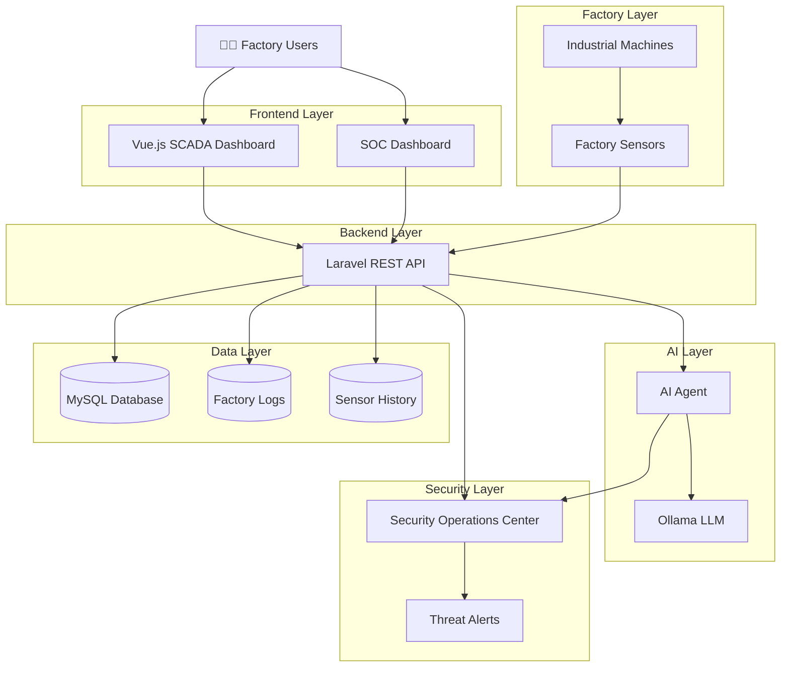
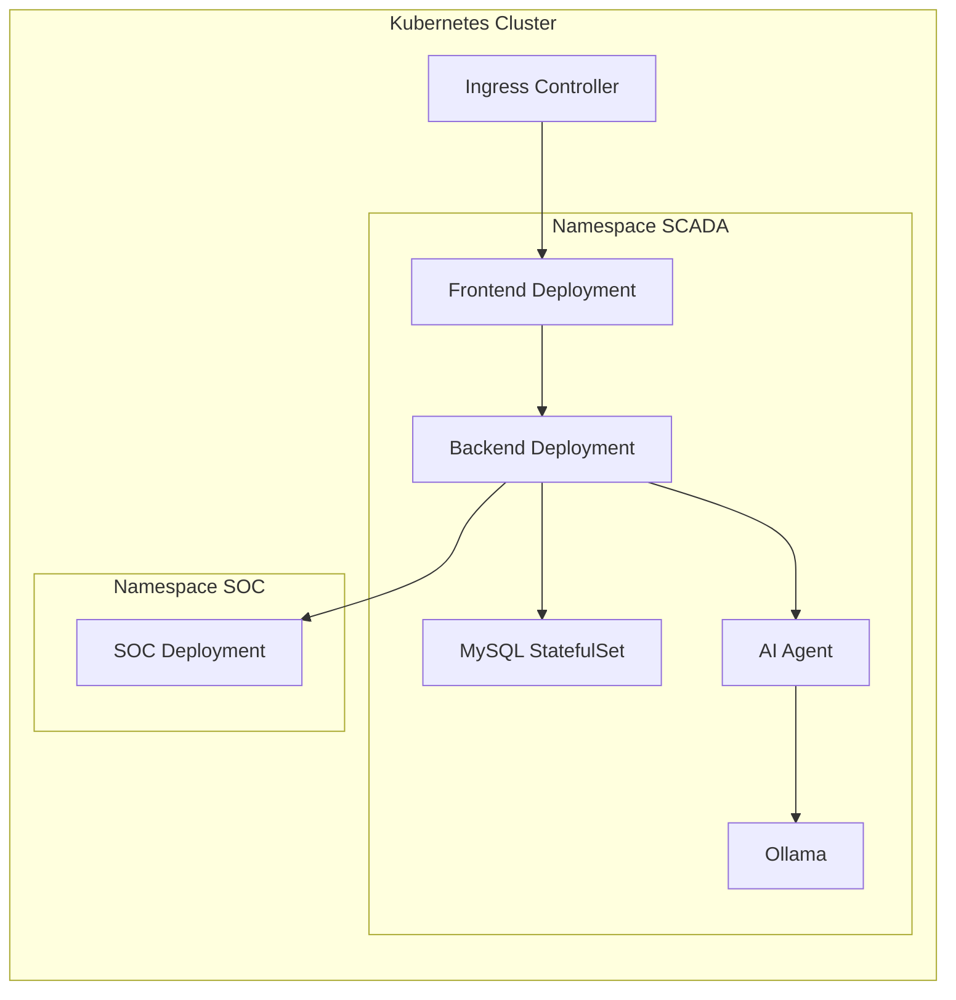
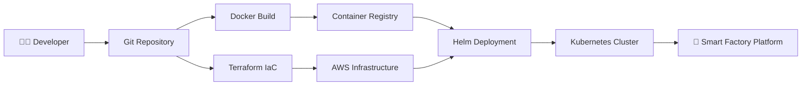
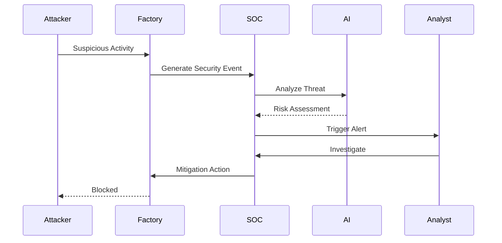
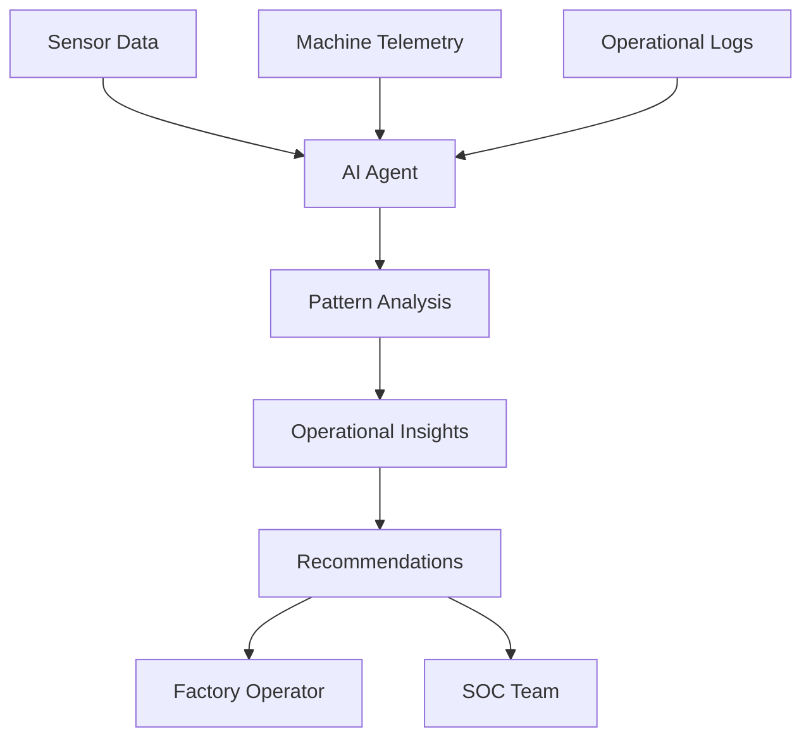
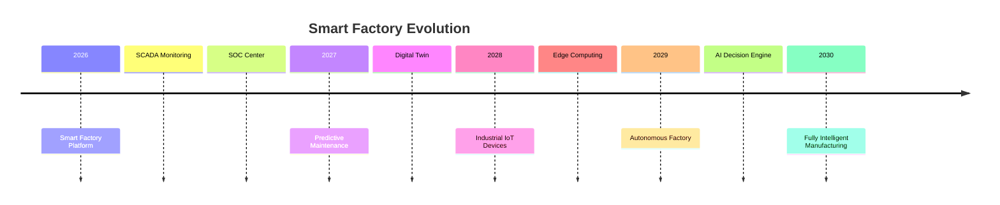

<!-- ===================================================== -->

<!--          CYBERPUNK ENTERPRISE README                  -->

<!-- ===================================================== -->

<div align="center">

# 🌌⚡ SMART FACTORY SIMULATION SYSTEM ⚡🌌

### 🏭 Industry 4.0 • 🤖 Artificial Intelligence • 🛡️ Cyber Security • ☁️ Cloud Native


<br>


<br>


</div>

---

# 🌍 PROJECT VISION

> Imagine a manufacturing environment where every machine is connected, every sensor speaks, every security threat is detected instantly, and Artificial Intelligence assists operators in making critical decisions.

The **Smart Factory Simulation System** is a complete Industry 4.0 ecosystem designed to simulate a modern industrial plant through:

* 🏭 SCADA Monitoring
* 🤖 AI-Powered Operations
* 🛡️ Security Operations Center (SOC)
* ☁️ AWS Cloud Infrastructure
* ⚙️ Infrastructure as Code
* 🚀 Kubernetes Orchestration
* 📊 Real-Time Analytics
* 🔒 Zero Trust Network Design

---

# 🔥 SYSTEM OVERVIEW

```text
╔════════════════════════════════════════════════════════════╗
║                     SMART FACTORY                         ║
╚════════════════════════════════════════════════════════════╝

      ⚙️ MACHINES
             │
             ▼

      📡 SENSORS
             │
             ▼

      📊 SCADA SYSTEM
             │
             ▼

      🧠 AI AGENT
             │
             ▼

      🛡️ SOC CENTER
             │
             ▼

      👨‍🏭 FACTORY OPERATORS
```

---

# 🏗️ ENTERPRISE SYSTEM ARCHITECTURE



---

# ☁️ AWS CLOUD ARCHITECTURE

```mermaid
flowchart TB

Internet((🌍 Internet))

subgraph AWS Cloud

subgraph VPC

subgraph Public Subnets
ALB[Application Load Balancer]
Bastion[Bastion Host]
end

subgraph Private Subnets

subgraph EKS Cluster

FrontendPod[Frontend Pods]

BackendPod[Backend Pods]

AgentPod[AI Agent Pods]

SOCPod[SOC Pods]

MySQLPod[MySQL StatefulSet]

end

end

end

end

Internet --> ALB

ALB --> FrontendPod

FrontendPod --> BackendPod

BackendPod --> MySQLPod

BackendPod --> AgentPod

BackendPod --> SOCPod

Bastion --> EKS Cluster
```

---

# ☸️ KUBERNETES CLUSTER DESIGN



---

# ⚡ CI/CD PIPELINE



---

# 🛡️ SOC ATTACK FLOW



---

# 🤖 AI AGENT DECISION FLOW



---

# 🎨 CYBERPUNK TECHNOLOGY MATRIX

```yaml
SYSTEM_CORE:

  Frontend:
    Framework: Vue.js
    Dashboard: SCADA UI

  Backend:
    Framework: Laravel
    Architecture: REST API

  Database:
    Engine: MySQL

  AI:
    Engine: Ollama
    Assistant: AI Agent

  Security:
    Platform: SOC

  Infrastructure:
    Cloud: AWS
    IaC: Terraform
    Automation: Ansible

  Containerization:
    Docker: Enabled

  Orchestration:
    Kubernetes: Enabled
    Helm: Enabled
```

---

# 📂 PROJECT STRUCTURE

```text
🏭 Smart-Factory-Simulation-System

├── 🎨 Full-SCADA-System
│   └── Vue.js Frontend

├── ⚙️ Scada-main-system
│   └── Laravel Backend

├── 🤖 AI Agent
│   └── Ollama Integration

├── 🛡️ SOC Platform
│   └── Threat Monitoring

├── 🐳 Docker
│   └── Container Images

├── ☸️ Kubernetes
│   └── Deployments

├── 🚀 Helm
│   └── Release Templates

├── ☁️ Terraform
│   └── AWS Infrastructure

└── 🔧 Ansible
    └── Configuration Automation
```

---

# 📸 SCREENSHOTS GALLERY

> Replace with your screenshots later

```md
## SCADA Dashboard


---

## Sensor Monitoring


---

## SOC Dashboard


---

## AI Assistant


---

## Kubernetes Monitoring


```

---

# 🔐 SECURITY FEATURES

| Feature                  | Status |
| ------------------------ | ------ |
| Network Policies         | ✅      |
| Namespace Isolation      | ✅      |
| Secrets Management       | ✅      |
| Service Segmentation     | ✅      |
| SOC Monitoring           | ✅      |
| Threat Detection         | ✅      |
| Alerting Engine          | ✅      |
| Infrastructure Hardening | ✅      |

---

# 📊 PLATFORM CAPABILITIES

```text
┌────────────────────────────────────┐
│ REAL-TIME MONITORING         ████ │
│ HISTORICAL ANALYTICS         ████ │
│ AI ASSISTANCE                ████ │
│ SOC VISIBILITY               ████ │
│ CLOUD SCALABILITY            ████ │
│ DEVOPS AUTOMATION            ████ │
│ SECURITY MONITORING          ████ │
│ INDUSTRY 4.0 READINESS       ████ │
└────────────────────────────────────┘
```

---

# 🔮 FUTURE ROADMAP



---

<div align="center">

# 🌌 INDUSTRY 4.0 STARTS HERE 🌌

### 🏭 SMART FACTORY • 🤖 AI • 🛡️ SOC • ☁️ CLOUD • 🚀 DEVOPS

---

### Developed by DiGiLiANS Team

### Digital Pioneers Initiative 2026

---

⭐ If you like this project, give it a star ⭐


</div>
